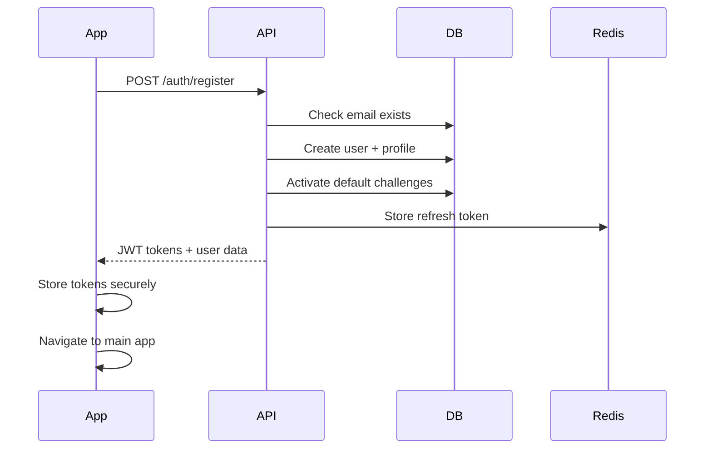
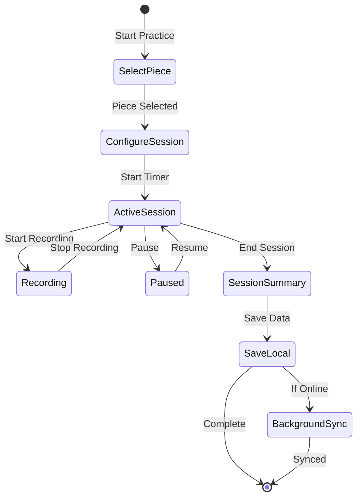
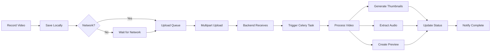

# 🎼 Music Practice Tracker - Comprehensive Technical Report

## 📋 Table of Contents
1. [Executive Summary](#executive-summary)
2. [Architecture Overview](#architecture-overview)
3. [Technology Stack](#technology-stack)
4. [Database Design & Handling](#database-design--handling)
5. [Core Workflows](#core-workflows)
6. [API Design & Implementation](#api-design--implementation)
7. [Technical Features Implementation](#technical-features-implementation)
8. [Special Algorithms & Features](#special-algorithms--features)
9. [Security & Performance](#security--performance)
10. [Development Insights](#development-insights)

---

## Executive Summary

The Music Practice Tracker is a comprehensive mobile-first application designed to revolutionize music education through technology. It connects students and teachers in a digital ecosystem that tracks practice sessions, provides real-time feedback, enables video recording/review, and fosters community learning through forums.

**Key Innovations:**
- **Offline-First Architecture**: Full functionality without internet, with automatic sync
- **Video Recording & Analysis**: Practice session recording with teacher feedback
- **Tempo Detection**: Real-time audio analysis for tempo accuracy feedback
- **Gamification**: Points, achievements, and challenges to motivate practice
- **Community Features**: Forum with reputation system and practice partner matching

---

## Architecture Overview

### System Architecture
```
┌─────────────────────────────────────────────────────────────┐
│                   Client Layer (Mobile)                       │
│  ┌─────────────────┐  ┌──────────────┐  ┌──────────────┐   │
│  │ React Native    │  │  Redux Store │  │    SQLite    │   │
│  │    (Expo)       │  │              │  │ (Local DB)   │   │
│  └────────┬────────┘  └──────┬───────┘  └──────┬───────┘   │
└───────────┼──────────────────┼─────────────────┼────────────┘
            │                  │                  │
            ▼                  ▼                  ▼
┌─────────────────────────────────────────────────────────────┐
│                    API Gateway Layer                         │
│  ┌──────────────────────────────────────────────────────┐   │
│  │          FastAPI (REST API) - Port 8000              │   │
│  │  - JWT Authentication    - Request Validation        │   │
│  │  - CORS Middleware       - Error Handling            │   │
│  └─────────────────────────┬────────────────────────────┘   │
└────────────────────────────┼─────────────────────────────────┘
                             │
┌────────────────────────────┼─────────────────────────────────┐
│                   Backend Services Layer                      │
│  ┌──────────────┐  ┌──────────────┐  ┌──────────────────┐   │
│  │  Business     │  │   Celery     │  │   Background     │   │
│  │  Logic        │  │   Workers    │  │   Services       │   │
│  │  Services     │  │              │  │                  │   │
│  └──────┬───────┘  └──────┬───────┘  └────────┬─────────┘   │
└─────────┼─────────────────┼───────────────────┼──────────────┘
          │                 │                   │
┌─────────┼─────────────────┼───────────────────┼──────────────┐
│         ▼                 ▼                   ▼              │
│  ┌──────────────┐  ┌──────────────┐  ┌──────────────────┐   │
│  │ PostgreSQL   │  │    Redis     │  │      MinIO       │   │
│  │ +TimescaleDB │  │  (Cache &    │  │   (S3-compat     │   │
│  │              │  │   Queue)     │  │  Object Store)   │   │
│  └──────────────┘  └──────────────┘  └──────────────────┘   │
│                   Data Storage Layer                          │
└───────────────────────────────────────────────────────────────┘
```

### Key Architectural Decisions

1. **Offline-First Mobile**: SQLite for local storage with background sync
2. **Microservices Pattern**: Separated concerns with dedicated services
3. **Event-Driven Processing**: Celery for async video processing
4. **Time-Series Optimization**: TimescaleDB for practice metrics
5. **Object Storage**: MinIO for scalable media storage

---

## Technology Stack

### Frontend (Mobile App)
- **Framework**: React Native with Expo SDK 51
- **Language**: TypeScript
- **State Management**: Redux Toolkit with Redux Persist
- **Navigation**: React Navigation v6
- **UI Components**: Custom components with Reanimated 3
- **Local Storage**: SQLite (expo-sqlite) for offline data
- **Charts**: Victory Native for analytics
- **Animations**: Lottie, Reanimated 3, React Native Skia

### Backend
- **Framework**: FastAPI (Python 3.11)
- **ORM**: SQLAlchemy 2.0 with async support
- **Database**: PostgreSQL 15 + TimescaleDB
- **Cache/Queue**: Redis
- **Task Queue**: Celery with Redis broker
- **Object Storage**: MinIO (S3-compatible)
- **Authentication**: JWT (PyJWT)
- **Validation**: Pydantic v2

### DevOps & Infrastructure
- **Containerization**: Docker & Docker Compose
- **Development**: Hot reload for both frontend and backend
- **API Documentation**: OpenAPI/Swagger auto-generated
- **Testing**: Pytest (backend), Jest (frontend)

---

## Database Design & Handling

### Core Database Schema

#### 1. User System
```sql
-- User hierarchy with role-based access
users (
    id UUID PRIMARY KEY,
    email VARCHAR UNIQUE,
    full_name VARCHAR,
    role ENUM('student', 'teacher', 'admin'),
    is_active BOOLEAN,
    reputation_points INTEGER DEFAULT 0,
    created_at TIMESTAMP WITH TIME ZONE
)

-- Separate profiles for students and teachers
students (
    id UUID PRIMARY KEY,
    user_id UUID REFERENCES users(id),
    grade_level VARCHAR,
    years_playing INTEGER,
    timezone VARCHAR
)

teachers (
    id UUID PRIMARY KEY,
    user_id UUID REFERENCES users(id),
    bio TEXT,
    specialties VARCHAR[],
    verification_status VARCHAR
)

-- Many-to-many relationship
student_teacher_associations (
    student_id UUID REFERENCES students(id),
    teacher_id UUID REFERENCES teachers(id),
    created_at TIMESTAMP,
    PRIMARY KEY (student_id, teacher_id)
)
```

#### 2. Practice Session System
```sql
-- Main practice session tracking
practice_sessions (
    id UUID PRIMARY KEY,
    student_id UUID REFERENCES students(id),
    focus TEXT,  -- What they practiced
    start_time TIMESTAMP WITH TIME ZONE,
    end_time TIMESTAMP WITH TIME ZONE,
    self_rating INTEGER CHECK (self_rating BETWEEN 1 AND 5),
    note TEXT,
    target_tempo INTEGER,
    practice_mode VARCHAR,  -- 'normal', 'slow_practice', 'performance'
    created_at TIMESTAMP WITH TIME ZONE
)

-- Tags for categorization (pieces are special tags)
tags (
    id UUID PRIMARY KEY,
    name VARCHAR UNIQUE,
    color VARCHAR,
    tag_type VARCHAR DEFAULT 'general',  -- 'general', 'piece', 'technique'
    user_id UUID REFERENCES users(id),  -- NULL for global tags
    -- Special fields for musical pieces
    composer VARCHAR,
    difficulty_level INTEGER,
    typical_duration INTEGER
)

-- Many-to-many session tags
session_tags (
    session_id UUID REFERENCES practice_sessions(id),
    tag_id UUID REFERENCES tags(id),
    PRIMARY KEY (session_id, tag_id)
)
```

#### 3. Video Management
```sql
videos (
    id UUID PRIMARY KEY,
    session_id UUID REFERENCES practice_sessions(id),
    file_key VARCHAR,  -- MinIO/S3 object key
    file_size BIGINT,
    duration FLOAT,
    processing_status VARCHAR,  -- 'pending', 'processing', 'completed', 'failed'
    processed_at TIMESTAMP,
    metadata JSONB  -- Flexible metadata storage
)
```

#### 4. Forum System
```sql
-- Forum posts
forum_posts (
    id UUID PRIMARY KEY,
    author_id UUID REFERENCES users(id),
    title VARCHAR,
    content TEXT,
    status VARCHAR,  -- 'draft', 'published', 'closed', 'deleted'
    vote_score INTEGER DEFAULT 0,
    view_count INTEGER DEFAULT 0,
    related_piece_id UUID REFERENCES tags(id),  -- Link to musical piece
    accepted_answer_id UUID,
    created_at TIMESTAMP WITH TIME ZONE
)

-- Threaded comments
forum_comments (
    id UUID PRIMARY KEY,
    post_id UUID REFERENCES forum_posts(id),
    author_id UUID REFERENCES users(id),
    parent_id UUID REFERENCES forum_comments(id),  -- For threading
    content TEXT,
    vote_score INTEGER DEFAULT 0,
    is_solution BOOLEAN DEFAULT FALSE
)

-- Voting system
post_votes (
    user_id UUID REFERENCES users(id),
    post_id UUID REFERENCES forum_posts(id),
    vote_type INTEGER,  -- 1 or -1
    PRIMARY KEY (user_id, post_id)
)
```

#### 5. Time-Series Data (TimescaleDB)
```sql
-- Hypertable for practice metrics
practice_metrics (
    time TIMESTAMPTZ NOT NULL,
    student_id UUID,
    metric_type VARCHAR,  -- 'tempo_accuracy', 'practice_duration', etc.
    value FLOAT,
    metadata JSONB
);

-- Create hypertable
SELECT create_hypertable('practice_metrics', 'time');

-- Continuous aggregates for performance
CREATE MATERIALIZED VIEW practice_metrics_hourly
WITH (timescaledb.continuous) AS
SELECT 
    time_bucket('1 hour', time) AS bucket,
    student_id,
    metric_type,
    AVG(value) as avg_value,
    COUNT(*) as count
FROM practice_metrics
GROUP BY bucket, student_id, metric_type;
```

### Database Features & Optimizations

1. **UUID Primary Keys**: For distributed systems compatibility
2. **JSONB Columns**: Flexible metadata storage without schema changes
3. **Indexes**: On foreign keys, frequently queried fields
4. **Soft Deletes**: Status fields instead of hard deletes
5. **TimescaleDB**: 
   - Automatic partitioning by time
   - Compression policies for old data
   - Continuous aggregates for real-time analytics
6. **Triggers**: Updated_at timestamps, vote score calculations

---

## Core Workflows

### 1. User Registration & Authentication Flow



**Implementation Details:**
- Password hashing with bcrypt
- JWT with access (30 min) + refresh (7 days) tokens
- Automatic role-based profile creation
- Secure token storage in device keychain

### 2. Practice Session Workflow



**Key Features:**
- **Offline-First**: Sessions saved to SQLite immediately
- **Background Sync**: Automatic upload when network available
- **Video Optional**: Can practice without recording
- **Rich Metadata**: Tags, tempo, focus areas, segments

### 3. Video Upload & Processing Workflow



**Technical Details:**
- **Chunked Upload**: 5MB chunks for reliability
- **Resume Support**: Tracks upload progress
- **Queue Management**: Max 2 concurrent uploads
- **Auto-Retry**: Exponential backoff on failure
- **Processing Pipeline**: FFmpeg for video operations

### 4. Forum Interaction Workflow

**Post Creation:**
1. User selects musical piece (optional)
2. Writes content with markdown support
3. Adds media attachments
4. System assigns tags
5. Post published with reputation points

**Voting & Reputation:**
- Upvote: +10 points to author
- Downvote: -2 points to author
- Accepted answer: +15 points
- Daily first post: +5 points

### 5. Teacher Review Workflow

1. **Dashboard View**: See all students' recent activity
2. **Student Selection**: View individual progress
3. **Session Review**: 
   - Watch practice videos
   - View practice metrics
   - Add timestamped feedback
4. **Feedback Delivery**: 
   - Written comments
   - Video annotations
   - Progress tracking

---

## API Design & Implementation

### RESTful Design Principles

1. **Resource-Based URLs**: `/api/v1/sessions`, `/api/v1/videos`
2. **HTTP Methods**: GET, POST, PUT, DELETE properly used
3. **Status Codes**: Appropriate HTTP status codes
4. **Pagination**: Consistent skip/limit pattern
5. **Filtering**: Query parameters for filtering

### Authentication & Authorization

```python
# JWT Token validation
async def get_current_user(token: str = Depends(oauth2_scheme)) -> User:
    credentials_exception = HTTPException(
        status_code=401,
        detail="Could not validate credentials",
    )
    try:
        payload = jwt.decode(token, SECRET_KEY, algorithms=[ALGORITHM])
        user_id: str = payload.get("sub")
        if user_id is None:
            raise credentials_exception
    except JWTError:
        raise credentials_exception
    
    user = await get_user(user_id)
    if user is None:
        raise credentials_exception
    return user

# Role-based access
async def get_current_teacher(
    current_user: User = Depends(get_current_user)
) -> Teacher:
    if current_user.role != "teacher":
        raise HTTPException(status_code=403, detail="Not authorized")
    return current_user.teacher_profile
```

### API Versioning

- URL versioning: `/api/v1/`
- Backwards compatibility maintained
- Deprecation notices in headers

### Error Handling

```python
@app.exception_handler(ValidationError)
async def validation_exception_handler(request: Request, exc: ValidationError):
    return JSONResponse(
        status_code=422,
        content={"detail": exc.errors(), "body": exc.body}
    )

# Consistent error response format
{
    "detail": "Error message",
    "code": "ERROR_CODE",
    "field": "field_name"  // For validation errors
}
```

---

## Technical Features Implementation

### 1. Offline-First Architecture

**Local Database Schema:**
```typescript
interface LocalSession {
  id: string;
  student_id: string;
  focus: string | null;
  start_time: string;
  end_time: string | null;
  self_rating: number | null;
  note: string | null;
  tags: string;  // JSON string
  synced: boolean;
  created_at: string;
}
```

**Sync Strategy:**
```typescript
// Network listener
NetInfo.addEventListener(state => {
  if (state.isConnected && !isSyncing) {
    syncPendingSessions();
  }
});

// Sync only newest to prevent UI blocking
const syncPendingSessions = async () => {
  const pending = await getUnsyncedSessions();
  const newest = pending[pending.length - 1];
  if (newest) {
    await syncSession(newest);
  }
};
```

### 2. Video Upload System

**Queue Implementation:**
```typescript
class VideoUploadService {
  private uploadQueue: UploadTask[] = [];
  private activeUploads = 0;
  private readonly MAX_CONCURRENT = 2;

  async addToQueue(task: UploadTask) {
    this.uploadQueue.push(task);
    this.processQueue();
  }

  private async processQueue() {
    while (this.activeUploads < this.MAX_CONCURRENT && this.uploadQueue.length > 0) {
      const task = this.uploadQueue.shift();
      this.activeUploads++;
      this.uploadTask(task).finally(() => {
        this.activeUploads--;
        this.processQueue();
      });
    }
  }
}
```

### 3. Real-Time Features

**Tempo Detection Service:**
```typescript
export class TempoDetectionService {
  private beatTimes: number[] = [];
  private targetTempo: number;
  
  detectTempo(audioData: Float32Array): TempoResult {
    // Simplified beat detection
    const beats = this.findBeats(audioData);
    const intervals = this.calculateIntervals(beats);
    const averageBPM = 60000 / this.average(intervals);
    
    // Check for common multiples
    const multiples = [0.25, 0.5, 0.75, 1, 1.5, 2, 3, 4];
    let bestMatch = this.findBestMultiple(averageBPM, multiples);
    
    const accuracy = this.calculateAccuracy(intervals);
    const mood = this.getMoodFromAccuracy(accuracy);
    
    return { bpm: bestMatch.bpm, accuracy, mood };
  }
}
```

### 4. Push Notifications

```typescript
// Notification scheduling
export const schedulePracticeReminder = async (time: Date) => {
  await Notifications.scheduleNotificationAsync({
    content: {
      title: "Time to Practice! 🎵",
      body: "Your instruments are waiting for you",
      data: { type: 'practice_reminder' },
    },
    trigger: { date: time },
  });
};
```

---

## Special Algorithms & Features

### 1. Angry Metronome

The "Angry Metronome" provides visual feedback based on tempo accuracy:

```typescript
interface MetronomeMood {
  expression: 'happy' | 'neutral' | 'annoyed' | 'angry';
  color: string;
  animation: string;
}

const getMood = (accuracy: number): MetronomeMood => {
  if (accuracy >= 90) return { expression: 'happy', color: '#4CAF50', animation: 'bounce' };
  if (accuracy >= 75) return { expression: 'neutral', color: '#2196F3', animation: 'pulse' };
  if (accuracy >= 60) return { expression: 'annoyed', color: '#FF9800', animation: 'shake' };
  return { expression: 'angry', color: '#F44336', animation: 'vibrate' };
};
```

### 2. Meditation Mode

Activated when tempo < 60 BPM:
- Breathing circle animations
- Calming color transitions
- 3x points multiplier
- Special achievements

### 3. Practice Segments

Click tracking for specific focus areas:
```typescript
interface PracticeSegment {
  id: string;
  name: string;
  clickCount: number;
  lastClicked: Date;
}

// Heatmap generation for most practiced sections
const generatePracticeHeatmap = (segments: PracticeSegment[]) => {
  return segments.map(s => ({
    ...s,
    intensity: s.clickCount / maxClicks,
    color: interpolateColor('#FFE5B4', '#FF4500', s.clickCount / maxClicks)
  }));
};
```

### 4. Gamification System

**Points Calculation:**
```typescript
const calculatePracticePoints = (session: Session): number => {
  let points = 0;
  const duration = (session.endTime - session.startTime) / 60000; // minutes
  
  // Base points for practice time
  points += Math.floor(duration);
  
  // Tempo bonus
  if (session.averageTempo < session.targetTempo) {
    points += Math.floor(duration); // Double points for slow practice
  }
  
  // Meditation mode bonus
  if (session.targetTempo < 60) {
    points += Math.floor(duration * 2); // Triple total
  }
  
  // Consistency bonus
  if (session.tempoAccuracy > 85) {
    points += 10;
  }
  
  return points;
};
```

### 5. Smart Practice Recommendations

```python
async def get_practice_recommendations(student_id: UUID) -> List[Recommendation]:
    # Analyze recent sessions
    recent_sessions = await get_recent_sessions(student_id, days=7)
    
    # Identify patterns
    weak_areas = analyze_problem_areas(recent_sessions)
    tempo_trends = analyze_tempo_progress(recent_sessions)
    
    recommendations = []
    
    # Recommend slower practice for problem areas
    for area in weak_areas:
        if area.accuracy < 70:
            recommendations.append({
                "type": "slow_practice",
                "piece": area.piece,
                "segment": area.segment,
                "suggested_tempo": area.current_tempo * 0.7
            })
    
    return recommendations
```

---

## Security & Performance

### Security Measures

1. **Authentication**:
   - JWT with short-lived access tokens
   - Refresh token rotation
   - Secure token storage (device keychain)

2. **Data Protection**:
   - HTTPS everywhere
   - Input validation with Pydantic
   - SQL injection protection via ORM
   - XSS prevention

3. **API Security**:
   - Rate limiting
   - CORS properly configured
   - Request size limits
   - File upload validation

### Performance Optimizations

1. **Database**:
   - Connection pooling
   - Query optimization with proper indexes
   - TimescaleDB for time-series data
   - Materialized views for analytics

2. **Caching**:
   - Redis for session data
   - Frontend Redux persist
   - Image caching
   - API response caching

3. **Mobile**:
   - Lazy loading of screens
   - Image optimization
   - Debounced searches
   - Virtualized lists

4. **Backend**:
   - Async/await throughout
   - Background task processing
   - Efficient pagination
   - Bulk operations where possible

---

## Development Insights

### Architecture Patterns

1. **Repository Pattern**: Data access abstraction
2. **Service Layer**: Business logic separation
3. **Dependency Injection**: FastAPI's DI system
4. **Observer Pattern**: Redux for state management
5. **Strategy Pattern**: Different upload strategies

### Code Organization

```
mobile-app/
├── src/
│   ├── components/     # Reusable UI components
│   ├── screens/        # Screen components
│   ├── services/       # API and business logic
│   ├── store/          # Redux store
│   ├── hooks/          # Custom React hooks
│   └── utils/          # Helper functions

backend/
├── app/
│   ├── api/           # API endpoints
│   ├── core/          # Core configuration
│   ├── models/        # Database models
│   ├── schemas/       # Pydantic schemas
│   ├── services/      # Business logic
│   └── utils/         # Utilities
```

### Testing Strategy

1. **Unit Tests**: Core business logic
2. **Integration Tests**: API endpoints
3. **E2E Tests**: Critical user flows
4. **Performance Tests**: Load testing for video uploads

### Monitoring & Debugging

1. **Logging**: Structured logging with context
2. **Error Tracking**: Sentry integration ready
3. **Performance Monitoring**: Custom metrics to TimescaleDB
4. **Debug Tools**: React Native Debugger, Redux DevTools

### Scalability Considerations

1. **Horizontal Scaling**: Stateless API servers
2. **Database Sharding**: By user_id if needed
3. **CDN**: For video delivery
4. **Microservices**: Video processing can be separated
5. **Event Sourcing**: For practice session history

---

## Conclusion

The Music Practice Tracker represents a sophisticated blend of mobile and web technologies designed to enhance music education. Its offline-first architecture, real-time features, and comprehensive tracking capabilities make it a powerful tool for both students and teachers.

**Key Technical Achievements:**
- Robust offline support with intelligent sync
- Scalable video processing pipeline
- Real-time tempo detection and feedback
- Comprehensive gamification system
- Clean, maintainable architecture

**Future Enhancements:**
- AI-powered practice recommendations
- Real-time collaboration features
- Advanced audio analysis
- Social features expansion
- Multi-platform support (web, desktop)

This technical foundation provides a solid base for continued innovation in music education technology.