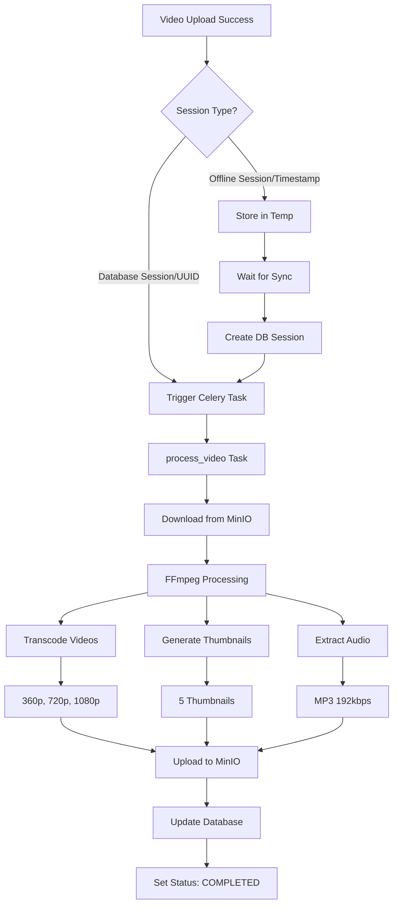

# 🎬 Video Processing Flow Documentation

## 📊 Complete Flow After Upload



## 🔄 Processing Status Values

```python
class ProcessingStatus(Enum):
    PENDING = "pending"      # Initial state after upload
    PROCESSING = "processing" # Currently being processed
    COMPLETED = "completed"  # Successfully processed
    FAILED = "failed"       # Processing failed
```

## 📁 Storage Structure in MinIO

```
music-tracker/
├── videos/
│   ├── original/           # Original uploads (DB sessions)
│   │   └── session_{uuid}_{filename}.mp4
│   ├── temp/              # Temporary uploads (offline sessions)
│   │   └── user_{id}/session_{timestamp}_{filename}.mp4
│   ├── transcoded/        # Processed videos
│   │   ├── 360p/
│   │   ├── 720p/
│   │   └── 1080p/
│   ├── thumbnails/        # Generated thumbnails
│   │   └── session_{id}/
│   │       ├── thumb_0.jpg
│   │       ├── thumb_1.jpg
│   │       └── ...
│   └── audio/            # Extracted audio
│       └── session_{id}.mp3
```

## 🎯 Celery Tasks

### 1. process_video (Single Video)
```python
@celery_app.task(bind=True, max_retries=3)
def process_video(
    self,
    session_id: str,
    video_key: str,
    user_id: str,
    qualities: List[str] = None
):
    # Downloads video from MinIO
    # Runs FFmpeg commands
    # Uploads results back to MinIO
    # Updates database status
```

### 2. process_video_batch (Multiple Videos)
```python
@celery_app.task
def process_video_batch(
    session_ids: List[int],
    qualities: List[str] = None
):
    # Queues individual process_video tasks
```

## 🛠️ FFmpeg Commands Used

### Video Transcoding
```bash
# 360p
ffmpeg -i input.mp4 -vf scale=640:360 -c:v libx264 -preset fast -crf 23 -c:a aac -b:a 128k output_360p.mp4

# 720p
ffmpeg -i input.mp4 -vf scale=1280:720 -c:v libx264 -preset fast -crf 23 -c:a aac -b:a 192k output_720p.mp4

# 1080p
ffmpeg -i input.mp4 -vf scale=1920:1080 -c:v libx264 -preset fast -crf 23 -c:a aac -b:a 256k output_1080p.mp4
```

### Thumbnail Generation
```bash
# Generate thumbnail at specific timestamp
ffmpeg -i input.mp4 -ss {timestamp} -vframes 1 -vf scale=320:180 thumb_{index}.jpg
```

### Audio Extraction
```bash
# Extract audio as MP3
ffmpeg -i input.mp4 -vn -acodec mp3 -ab 192k audio.mp3
```

## 📊 Database Updates During Processing

```python
# When processing starts
session.processing_status = ProcessingStatus.PROCESSING
session.processing_started_at = datetime.utcnow()
session.processing_progress = 0.1

# Progress updates
session.processing_progress = 0.3  # After download
session.processing_progress = 0.6  # After transcoding
session.processing_progress = 0.8  # After thumbnails

# When complete
session.processing_status = ProcessingStatus.COMPLETED
session.processing_completed_at = datetime.utcnow()
session.processing_progress = 1.0
session.processing_result = {
    "transcoded_videos": {...},
    "thumbnails": [...],
    "audio_track": {...},
    "video_info": {...}
}

# On failure
session.processing_status = ProcessingStatus.FAILED
session.processing_error = str(error)
```

## 🔍 Monitoring Processing

### 1. Flower UI
```bash
# View all Celery tasks
http://localhost:5555

# Filter by task name
process_video
```

### 2. Check Processing Status
```bash
# API endpoint
GET /api/v1/videos/{session_id}/status

# Response
{
    "session_id": 123,
    "status": "processing",
    "progress": 0.6,
    "started_at": "2025-01-26T10:00:00Z",
    "task_id": "abc-123-def"
}
```

### 3. View Logs
```bash
# Celery worker logs
docker-compose logs -f celery-worker

# Filter for specific session
docker-compose logs celery-worker | grep "session_123"
```

## 🐛 Common Processing Issues

### 1. Processing Stuck at PENDING
- Check if Celery workers are running: `docker-compose ps celery-worker`
- Check Redis connection: `docker exec musictracker-redis redis-cli ping`
- Check worker logs for errors

### 2. Processing Failed
- Check `processing_error` field in database
- Common errors:
  - "No such file": Video not found in MinIO
  - "Invalid codec": Corrupted video file
  - "Out of memory": Video too large

### 3. Slow Processing
- Check CPU usage: `docker stats`
- Reduce concurrent workers if needed
- Consider smaller video resolutions

## 🚀 Manual Processing Commands

```python
# Trigger processing for existing session
from app.tasks.video_tasks import process_video
process_video.delay("session_id", "video_key", "user_id")

# Check task status
from app.core.celery_app import celery_app
result = celery_app.AsyncResult("task_id")
print(result.status)  # PENDING, STARTED, SUCCESS, FAILURE
print(result.info)    # Task result or error info
```

## 📈 Next Phase: Analytics
After video processing completes, the audio file is ready for:
1. Librosa analysis (tempo, pitch, dynamics)
2. TimescaleDB metrics storage
3. Analytics dashboard display

---

**Note**: Video processing is CPU-intensive. On development machines, processing may take 1-2 minutes per video.